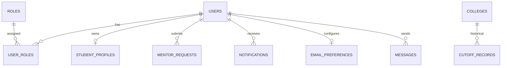

# LAUGHS WITH RAMESH CONNECTING — Database Schema Documentation

---

## 1. Entity Relationship Overview

---

## 2. Table Schemas Specification

### Core & Auth Tables
- `users` (id, email, password_hash, full_name, mobile_number, email_verified, mobile_verified, account_status, status, created_at, updated_at)
- `roles` (id, name)
- `user_roles` (user_id, role_id)
- `student_profiles` (id, user_id, college_name, intermediate_year, board, target_exam, target_branch, state, city, preferred_location, target_rank, profile_completed, updated_at)
- `otp_verifications` (id, user_id, purpose, otp_hash, expires_at, attempts, verified, created_at, last_attempt_at)

### Academic, College & Cutoff Tables
- `colleges` (id, code, name, location, city, state, type, affiliation, website, fees_per_year, placement_info, facilities, source, last_updated)
- `cutoff_records` (id, exam, year, counselling_round, college_code, college_name, branch_code, branch_name, category, opening_rank, closing_rank, source, last_updated)

### AI, Mentor & Notification Tables
- `mentor_requests` (id, student_id, category, student_message, ai_conversation_summary, priority, status, assigned_mentor_id, created_at, updated_at, resolved_at)
- `notifications` (id, user_id, title, message, link, type, is_read, created_at)
- `email_preferences` (id, user_id, new_mock_tests, new_study_materials, new_videos, important_announcements, mentor_replies, doubt_session_updates)
- `email_events` (id, recipient, event_type, status, provider_message_id, failure_reason, idempotency_key, created_at, sent_at)
- `messages` (id, sender_id, receiver_id, message_text, attachment_url, is_read, created_at)
